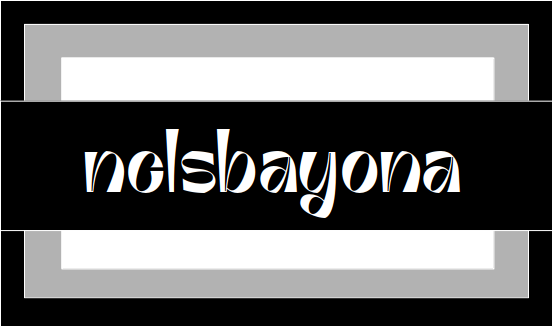

  

<h2 align="center">👋 Hey there 👋</h2>

<h3 align="center">I'm really grateful that you came here 😎</h3>

<!--p  align="center">

</p-->

  <strong align="center">Never forget:</strong>
  <i>&quot;Be thankful for everything that happens in your life; it's all an experience.&quot;</i>

----

Maybe you're looking for a drink? 🍹

 
<h4 align="center">Bounty Hunter</h4>

<h5 align="center">Alcoholic - Cocktail</h5>

<h5 align="center">Necessary ingredients</h5>
<table align="center">
<tr>
<td>
<table frame="box" rules="cols">
    <thead>
        <tr>
            <th style="padding-left: 1em; padding-right: 1em; text-align: center">Ingredient</th>
            <th style="padding-left: 1em; padding-right: 1em; text-align: center">Measure</th>
        </tr>
    </thead>
    <tbody>
        <tr>
            <td style="padding-left: 1em; padding-right: 1em; text-align: center; vertical-align: top">Rum</td>
            <td style="padding-left: 1em; padding-right: 1em; text-align: center; vertical-align: top">1 shot</td>
        </tr>
        <tr>
            <td style="padding-left: 1em; padding-right: 1em; text-align: center; vertical-align: top">Coconut Liqueur</td>
            <td style="padding-left: 1em; padding-right: 1em; text-align: center; vertical-align: top">1 shot</td>
        </tr>
        <tr>
            <td style="padding-left: 1em; padding-right: 1em; text-align: center; vertical-align: top">Blueberries</td>
            <td style="padding-left: 1em; padding-right: 1em; text-align: center; vertical-align: top">Garnish with</td>
        </tr>
        <tr>
            <td style="padding-left: 1em; padding-right: 1em; text-align: center; vertical-align: top">Pineapple Juice</td>
            <td style="padding-left: 1em; padding-right: 1em; text-align: center; vertical-align: top">Dash</td>
        </tr>
        <tr>
            <td style="padding-left: 1em; padding-right: 1em; text-align: center; vertical-align: top">Prosecco</td>
            <td style="padding-left: 1em; padding-right: 1em; text-align: center; vertical-align: top">Top</td>
        </tr>
        <tr>
            <td style="padding-left: 1em; padding-right: 1em; text-align: center; vertical-align: top"></td>
            <td style="padding-left: 1em; padding-right: 1em; text-align: center; vertical-align: top"></td>
        </tr>
        <tr>
            <td style="padding-left: 1em; padding-right: 1em; text-align: center; vertical-align: top"></td>
            <td style="padding-left: 1em; padding-right: 1em; text-align: center; vertical-align: top"></td>
        </tr>
    </tbody>
</table>
</td>
</tr>
</table>

Add the spirits into a shaker as well as the pineapple juice, strain into a Margarita glass. Top with Prosecco and garnish with Blueberries.

----

Maybe you're interested in learning more about my profile? 🪂

 
<h5 align="center">👀 Visitor count</h5>

----

Maybe you're interested in checking out my stats? 🐣

 
<h4 align="center">General GitHub Stats 🌀</h4>

<!--h5>😃 General Overview</h5-->

<!--h5>Life-Time Stats Overview 😃</h5-->

 

<h4 align="center">🤖 Programming Languages Stats</h4>

<!--h5>Most Used Languages Stats 💾</h5-->

 

<h4 align="center">⌚General Weekly-Stats</h4>
<table align="center">
<tr>
<td>
<table frame="box" rules="cols">
    <thead>
        <tr>
            <th style="padding-left: 1em; padding-right: 1em; text-align: center">Language name</th>
            <th style="padding-left: 1em; padding-right: 1em; text-align: center">Time spent</th>
        </tr>
    </thead>
    <tbody>
    </tbody>
</table>
</td>
<td>
<table frame="box" rules="cols">
    <thead>
        <tr>
            <th style="padding-left: 1em; padding-right: 1em; text-align: center">OS name</th>
            <th style="padding-left: 1em; padding-right: 1em; text-align: center">Time spent</th>
        </tr>
    </thead>
    <tbody>
    </tbody>
</table>
</td>
</tr>
</table>

----

Maybe you're looking to see something about our universe? 🔭

 
<h4 align="center">Spring Equinox at Teide Observatory - ©️ Juan Carlos Casado @ 2026-03-20</h4>

<h5 align="center">The defining astronomical moment of the equinox today is at 14:46 UTC (March 20). That's when the Sun crosses the celestial equator moving north in its yearly journey through planet Earth's sky, marking the beginning of spring for our fair planet in the northern hemisphere and fall in the southern hemisphere.  Then, day and night are nearly equal around the globe. In fact, both day and nighttime exposures from a spring equinox at the Observatorio del Teide in Tenerife, Canary Islands, Spain, are used in this composited skyscape. Over 1,000 images were taken with a fisheye lens and merged in the ambitious equinox project. The apparent motion of the Sun setting along the celestial equator on the equinox date follows the bright linear, diagonal track from the sequence of daytime exposures taken over 6 hours. After sunset, nighttime exposures recorded startrails, with the celestial equator as a linear track and concentric arcs circling the north celestial pole near Polaris at upper right and the south celestial pole beyond the lower left edge (and below the Teide horizon). The foreground includes the distant Teide volcano peak and the observatory's pyramid-shaped solar laboratory building.</h5>

----

Maybe you're looking for some cool animal pictures? 👁️

 
<table align="center">
<tr>
<td>

</td>
<td>

</td>
<td>

</td>
</tr>
<tr>
<td>

</td>
<td>

</td>
<td>

</td>
</tr>
<tr>
<td>

</td>
<td>

</td>
<td>

</td>
</tr>
<tr>
<td>

</td>
<td>

</td>
<td>

</td>
</tr>
<tr>
<td>

</td>
<td>

</td>
<td>

</td>
</tr>
<tr>
<td>

</td>
<td>

</td>
<td>

</td>
</tr>
<tr>
<td>

</td>
<td>

</td>
<td>

</td>
</tr>
<tr>
<td>

</td>
<td>

</td>
<td>

</td>
</tr>
</table>

----

Maybe you're interested in checking out my latest content? 🐣

 

[Connectivity at different layers](https://nclsbayona.github.io/p/connectivity-networking/)
> Sat, 03 Jan 2026 02:00:00 +0000

[Talos OS deployment](https://nclsbayona.github.io/p/kubernetes-talos/)
> Wed, 24 Dec 2025 08:00:00 +0000

[Deployment of secure webpages](https://nclsbayona.github.io/p/deployment-secure-webpages/)
> Mon, 31 Mar 2025 08:00:00 +0000

[Containerization Internals](https://nclsbayona.github.io/p/containers-internals/)
> Mon, 10 Mar 2025 12:00:00 +0000

[The value of becoming a Kubestronaut (and a Golden Kubestronaut) and why certifying is more than a title.](https://nclsbayona.github.io/p/certs-real-value/)
> Sat, 01 Mar 2025 08:00:00 +0000

----

----

<h3 align="center">Contact me! 📇</h3>

<!-- 

 !-->

 

<h3 align="center">Visit my webpage 🛸</h3>

