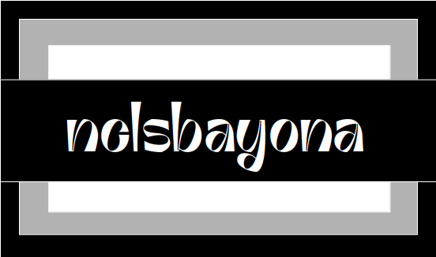

  

<h2 align="center">👋 Hey there 👋</h2>

<!--p  align="center">

</p-->

  

----

Maybe you're looking for a drink? 🍹

 
<h4 align="center">Tia-Maria</h4>

<h5 align="center">Alcoholic - Homemade Liqueur</h5>

<h5 align="center">Necessary ingredients</h5>
<table align="center">
<tr>
<td>
<table frame="box" rules="cols">
    <thead>
        <tr>
            <th style="padding-left: 1em; padding-right: 1em; text-align: center">Ingredient</th>
            <th style="padding-left: 1em; padding-right: 1em; text-align: center">Measure</th>
        </tr>
    </thead>
    <tbody>
        <tr>
            <td style="padding-left: 1em; padding-right: 1em; text-align: center; vertical-align: top">Water</td>
            <td style="padding-left: 1em; padding-right: 1em; text-align: center; vertical-align: top">1 cup </td>
        </tr>
        <tr>
            <td style="padding-left: 1em; padding-right: 1em; text-align: center; vertical-align: top">Brown sugar</td>
            <td style="padding-left: 1em; padding-right: 1em; text-align: center; vertical-align: top">3/4-1 cup </td>
        </tr>
        <tr>
            <td style="padding-left: 1em; padding-right: 1em; text-align: center; vertical-align: top">Coffee</td>
            <td style="padding-left: 1em; padding-right: 1em; text-align: center; vertical-align: top">4 tsp </td>
        </tr>
        <tr>
            <td style="padding-left: 1em; padding-right: 1em; text-align: center; vertical-align: top">Rum</td>
            <td style="padding-left: 1em; padding-right: 1em; text-align: center; vertical-align: top">1 cup </td>
        </tr>
        <tr>
            <td style="padding-left: 1em; padding-right: 1em; text-align: center; vertical-align: top">Vanilla extract</td>
            <td style="padding-left: 1em; padding-right: 1em; text-align: center; vertical-align: top">4 tsp </td>
        </tr>
    </tbody>
</table>
</td>
</tr>
</table>

Boil water, sugar and coffe for 10 mins and let cool. Add rum and vanilla. Put in clean bottle(s) and leave for 1 week before using.

----

Maybe you're interested in learning more about my profile? 🪂

 
<h5 align="center">👀 Visitor count</h5>

----

Maybe you're interested in checking out my stats? 🐣

 
<h4 align="center">General GitHub Stats 🌀</h4>

<!--h5>😃 General Overview</h5-->

<!--h5>Life-Time Stats Overview 😃</h5-->

 

<h4 align="center">🤖 Programming Languages Stats</h4>

<!--h5>Most Used Languages Stats 💾</h5-->

 

<h4 align="center">⌚General Weekly-Stats</h4>
<table align="center">
<tr>
<td>
<table frame="box" rules="cols">
    <thead>
        <tr>
            <th style="padding-left: 1em; padding-right: 1em; text-align: center">Language name</th>
            <th style="padding-left: 1em; padding-right: 1em; text-align: center">Time spent</th>
        </tr>
    </thead>
    <tbody>
    </tbody>
</table>
</td>
<td>
<table frame="box" rules="cols">
    <thead>
        <tr>
            <th style="padding-left: 1em; padding-right: 1em; text-align: center">OS name</th>
            <th style="padding-left: 1em; padding-right: 1em; text-align: center">Time spent</th>
        </tr>
    </thead>
    <tbody>
    </tbody>
</table>
</td>
</tr>
</table>

----

Maybe you're looking to see something about our universe? 🔭

 
<h4 align="center">Psyche Receives Gravity Assist from Mars - ©️ NASA @ 2026-07-29</h4>

<h5 align="center">Solar System bodies make deep space exploration more fuel efficient! Today’s video shows the Psyche spacecraft gaining speed and changing its trajectory with minimal fuel spent due to a gravity assist from Mars in May 2026. Mars has an average orbital speed of almost 87,000 km/h (54,000 mph) around the Sun. Its orbital motion and its gravity allowed Mars to pull Psyche along with it, increasing the spacecraft’s speed. Gravity assists have been used since 1959’s Luna 3 mission to allow for spacecraft (the Voyagers, Cassini) to reach farther than they could with fuel alone. This assist helped the Psyche spacecraft on its journey to the Psyche asteroid, which it will reach in 2029. While passing Mars, the spacecraft tested instruments that will analyze the asteroid’s composition and magnetic field. This is the first mission to an asteroid thought to be largely made of metal, an essential building block for planets, rather than rock or ice.   Find dark skies and look up this August to witness the Perseid meteor shower uninhibited by the Moon!</h5>

----

Maybe you're looking for some cool animal pictures? 👁️

 
<table align="center">
<tr>
<td>

</td>
<td>

</td>
<td>

</td>
</tr>
<tr>
<td>

</td>
<td>

</td>
<td>

</td>
</tr>
<tr>
<td>

</td>
<td>

</td>
<td>

</td>
</tr>
<tr>
<td>

</td>
<td>

</td>
<td>

</td>
</tr>
<tr>
<td>

</td>
<td>

</td>
<td>

</td>
</tr>
<tr>
<td>

</td>
<td>

</td>
<td>

</td>
</tr>
<tr>
<td>

</td>
<td>

</td>
<td>

</td>
</tr>
<tr>
<td>

</td>
<td>

</td>
<td>

</td>
</tr>
</table>

----

Maybe you're interested in checking out my latest content? 🐣

 

[Platform Engineering: From DevOps Principles to Internal Developer Platforms](https://nclsbayona.github.io/p/platform-engineering/)
> Mon, 13 Jul 2026 12:00:00 +0000

[Cloud-Native Lessons for AI: Applying Kubernetes Practices to Intelligent Systems](https://nclsbayona.github.io/p/cloud-native-lessons-ai-kubernetes/)
> Sat, 09 May 2026 13:14:26 +0000

[Connectivity at different layers](https://nclsbayona.github.io/p/connectivity-networking/)
> Sat, 03 Jan 2026 02:00:00 +0000

[Talos OS deployment](https://nclsbayona.github.io/p/kubernetes-talos/)
> Wed, 24 Dec 2025 08:00:00 +0000

[Deployment of secure webpages](https://nclsbayona.github.io/p/deployment-secure-webpages/)
> Mon, 31 Mar 2025 08:00:00 +0000

----

----

<h3 align="center">Contact me! 📇</h3>

<!-- 

 !-->

 

<h3 align="center">Visit my webpage 🛸</h3>

