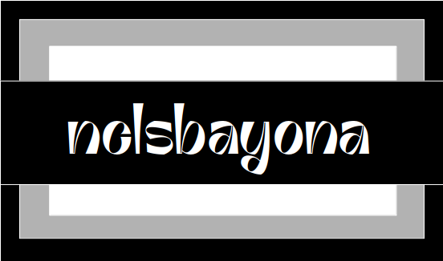

  

<h2 align="center">👋 Hey there 👋</h2>

<!--p  align="center">

</p-->

  

----

Maybe you're looking for a drink? 🍹

 
<h4 align="center">252</h4>

<h5 align="center">Alcoholic - Shot</h5>

<h5 align="center">Necessary ingredients</h5>
<table align="center">
<tr>
<td>
<table frame="box" rules="cols">
    <thead>
        <tr>
            <th style="padding-left: 1em; padding-right: 1em; text-align: center">Ingredient</th>
            <th style="padding-left: 1em; padding-right: 1em; text-align: center">Measure</th>
        </tr>
    </thead>
    <tbody>
        <tr>
            <td style="padding-left: 1em; padding-right: 1em; text-align: center; vertical-align: top">151 proof rum</td>
            <td style="padding-left: 1em; padding-right: 1em; text-align: center; vertical-align: top">1/2 shot Bacardi </td>
        </tr>
        <tr>
            <td style="padding-left: 1em; padding-right: 1em; text-align: center; vertical-align: top">Wild Turkey</td>
            <td style="padding-left: 1em; padding-right: 1em; text-align: center; vertical-align: top">1/2 shot </td>
        </tr>
    </tbody>
</table>
</td>
</tr>
</table>

Add both ingredients to shot glass, shoot, and get drunk quick

----

Maybe you're interested in learning more about my profile? 🪂

 
<h5 align="center">👀 Visitor count</h5>

----

Maybe you're interested in checking out my stats? 🐣

 
<h4 align="center">General GitHub Stats 🌀</h4>

<!--h5>😃 General Overview</h5-->

<!--h5>Life-Time Stats Overview 😃</h5-->

 

<h4 align="center">🤖 Programming Languages Stats</h4>

<!--h5>Most Used Languages Stats 💾</h5-->

 

<h4 align="center">⌚General Weekly-Stats</h4>
<table align="center">
<tr>
<td>
<table frame="box" rules="cols">
    <thead>
        <tr>
            <th style="padding-left: 1em; padding-right: 1em; text-align: center">Language name</th>
            <th style="padding-left: 1em; padding-right: 1em; text-align: center">Time spent</th>
        </tr>
    </thead>
    <tbody>
    </tbody>
</table>
</td>
<td>
<table frame="box" rules="cols">
    <thead>
        <tr>
            <th style="padding-left: 1em; padding-right: 1em; text-align: center">OS name</th>
            <th style="padding-left: 1em; padding-right: 1em; text-align: center">Time spent</th>
        </tr>
    </thead>
    <tbody>
    </tbody>
</table>
</td>
</tr>
</table>

----

Maybe you're looking to see something about our universe? 🔭

 
<h4 align="center">NASA Science - ©️ NASA @ 2026-10-08</h4>

<h5 align="center">How was the Saturn system imaged so clearly? Astrophotographer Tom Williams captured such exquisite details due to one night of exceptional atmospheric conditions above the United Kingdom. This means more than a cloudless sky. Pockets of air at different temperatures and densities move around and bend light as it travels through Earth’s atmosphere, distorting astronomy images. This is called “seeing”. Less atmospheric turbulence means clearer images. The astrophotographer reduced the impact of seeing with the lucky imaging technique: thousands of short-exposure images are taken very quickly with a high-speed camera and the clearest images are added up. Which object in this smörgåsbord interests you? Perhaps Titan or the icy stripes of Enceladus? Maybe the gaps and spokes in Saturn’s rings? Saturn's opposition, when Earth passes in between the planet and the Sun, occurred on October 4th. Due to the planet's proximity and full illumination from the Sun, now is a great time of year to observe it!Tomorrow's picture: bumpy						</h5>

----

Maybe you're looking for some cool animal pictures? 👁️

 
<table align="center">
<tr>
<td>

</td>
<td>

</td>
<td>

</td>
</tr>
<tr>
<td>

</td>
<td>

</td>
<td>

</td>
</tr>
<tr>
<td>

</td>
<td>

</td>
<td>

</td>
</tr>
<tr>
<td>

</td>
<td>

</td>
<td>

</td>
</tr>
<tr>
<td>

</td>
<td>

</td>
<td>

</td>
</tr>
<tr>
<td>

</td>
<td>

</td>
<td>

</td>
</tr>
<tr>
<td>

</td>
<td>

</td>
<td>

</td>
</tr>
<tr>
<td>

</td>
<td>

</td>
<td>

</td>
</tr>
</table>

----

Maybe you're interested in checking out my latest content? 🐣

 

[Platform Engineering: From DevOps Principles to Internal Developer Platforms](https://nclsbayona.github.io/p/platform-engineering/)
> Mon, 13 Jul 2026 12:00:00 +0000

[Cloud-Native Lessons for AI: Applying Kubernetes Practices to Intelligent Systems](https://nclsbayona.github.io/p/cloud-native-lessons-ai-kubernetes/)
> Sat, 09 May 2026 13:14:26 +0000

[Connectivity at different layers](https://nclsbayona.github.io/p/connectivity-networking/)
> Sat, 03 Jan 2026 02:00:00 +0000

[Talos OS deployment](https://nclsbayona.github.io/p/kubernetes-talos/)
> Wed, 24 Dec 2025 08:00:00 +0000

[Deployment of secure webpages](https://nclsbayona.github.io/p/deployment-secure-webpages/)
> Mon, 31 Mar 2025 08:00:00 +0000

----

----

<h3 align="center">Contact me! 📇</h3>

<!-- 

 !-->

 

<h3 align="center">Visit my webpage 🛸</h3>

