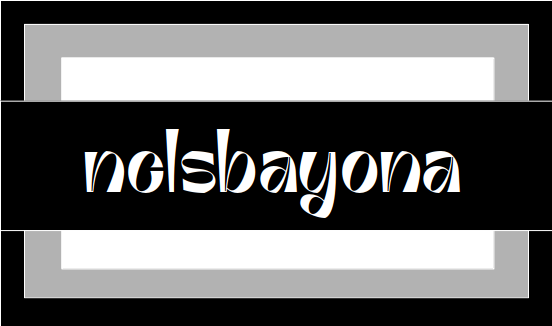

  

<h2 align="center">👋 Hey there 👋</h2>

<h3 align="center">I'm really grateful that you came here 😎</h3>

<!--p  align="center">

</p-->

  <strong align="center">Someone once said: &quot;Wuh pi-maat-kur opportunity du nam-tor seeking nam-tor svi' yourself. Ish-veh nam-tor ri svi' ish-veh ek'sitra; ish-veh nam-tor ri svi' kunli il pavesh,  il wuh gol'nev t' vath; ish-veh nam-tor svi' yourself sa'awek.&quot;</strong>
  <i>-- &quot;The golden opportunity you are seeking is in yourself. It is not in your environment; it is not in luck or chance, or the help of others; it is in yourself alone. &quot; in vulcan language --</i>

----

Maybe you're looking for a drink? 🍹

 
<h4 align="center">Zorro</h4>

<h5 align="center">Alcoholic - Coffee / Tea</h5>

<h5 align="center">Necessary ingredients</h5>
<table align="center">
<tr>
<td>
<table frame="box" rules="cols">
    <thead>
        <tr>
            <th style="padding-left: 1em; padding-right: 1em; text-align: center">Ingredient</th>
            <th style="padding-left: 1em; padding-right: 1em; text-align: center">Measure</th>
        </tr>
    </thead>
    <tbody>
        <tr>
            <td style="padding-left: 1em; padding-right: 1em; text-align: center; vertical-align: top">Sambuca</td>
            <td style="padding-left: 1em; padding-right: 1em; text-align: center; vertical-align: top">2 cl </td>
        </tr>
        <tr>
            <td style="padding-left: 1em; padding-right: 1em; text-align: center; vertical-align: top">Baileys irish cream</td>
            <td style="padding-left: 1em; padding-right: 1em; text-align: center; vertical-align: top">2 cl </td>
        </tr>
        <tr>
            <td style="padding-left: 1em; padding-right: 1em; text-align: center; vertical-align: top">White Creme de Menthe</td>
            <td style="padding-left: 1em; padding-right: 1em; text-align: center; vertical-align: top">2 cl </td>
        </tr>
    </tbody>
</table>
</td>
</tr>
</table>

add all and pour black coffee and add whipped cream on top.

----

Maybe you're interested in learning more about my profile? 🪂

 
<h5 align="center">👀 Visitor count</h5>

----

Maybe you're interested in checking out my stats? 🐣

 
<h4 align="center">General GitHub Stats 🌀</h4>

<!--h5>😃 General Overview</h5-->

<!--h5>Life-Time Stats Overview 😃</h5-->

 

<h4 align="center">🤖 Programming Languages Stats</h4>

<!--h5>Most Used Languages Stats 💾</h5-->

 

<h4 align="center">⌚General Weekly-Stats</h4>
<table align="center">
<tr>
<td>
<table frame="box" rules="cols">
    <thead>
        <tr>
            <th style="padding-left: 1em; padding-right: 1em; text-align: center">Language name</th>
            <th style="padding-left: 1em; padding-right: 1em; text-align: center">Time spent</th>
        </tr>
    </thead>
    <tbody>
    </tbody>
</table>
</td>
<td>
<table frame="box" rules="cols">
    <thead>
        <tr>
            <th style="padding-left: 1em; padding-right: 1em; text-align: center">OS name</th>
            <th style="padding-left: 1em; padding-right: 1em; text-align: center">Time spent</th>
        </tr>
    </thead>
    <tbody>
    </tbody>
</table>
</td>
</tr>
</table>

----

Maybe you're looking to see something about our universe? 🔭

 
<h4 align="center">The Umbra of Earth - ©️ Wang Letian @ 2025-09-11</h4>

<h5 align="center">The dark, inner shadow of planet Earth is called the umbra. Shaped like a cone extending into space, it has a circular cross section most easily seen during a lunar eclipse. And on the night of September 7/8 the Full Moon passed near the center of Earth's umbral cone, entertaining eclipse watchers around much of our fair planet, including parts of Antarctica, Australia, Asia, Europe, and Africa. Recorded from Zhangjiakou City, China, this timelapse composite image uses successive pictures from the total lunar eclipse, progressing left to right, to reveal the curved cross-section of the umbral shadow sliding across the Moon. Sunlight scattered by the atmosphere into Earth's umbra causes the lunar surface to appear reddened during totality. But close to the umbra's edge, the limb of the eclipsed Moon shows a distinct blue hue. The blue eclipsed moonlight originates as rays of sunlight pass through layers high in the upper stratosphere, colored by ozone that scatters red light and transmits blue. In the total phase of this leisurely lunar eclipse, the Moon was completely within the Earth's umbra for about 83 minutes.</h5>

----

Maybe you're looking for some cool animal pictures? 👁️

 
<table align="center">
<tr>
<td>

</td>
<td>

</td>
<td>

</td>
</tr>
<tr>
<td>

</td>
<td>

</td>
<td>

</td>
</tr>
<tr>
<td>

</td>
<td>

</td>
<td>

</td>
</tr>
<tr>
<td>

</td>
<td>

</td>
<td>

</td>
</tr>
<tr>
<td>

</td>
<td>

</td>
<td>

</td>
</tr>
<tr>
<td>

</td>
<td>

</td>
<td>

</td>
</tr>
<tr>
<td>

</td>
<td>

</td>
<td>

</td>
</tr>
<tr>
<td>

</td>
<td>

</td>
<td>

</td>
</tr>
</table>

----

----

<h3 align="center">Contact me! 📇</h3>

<!-- 

 !-->

 

<h3 align="center">Visit my webpage 🛸</h3>

